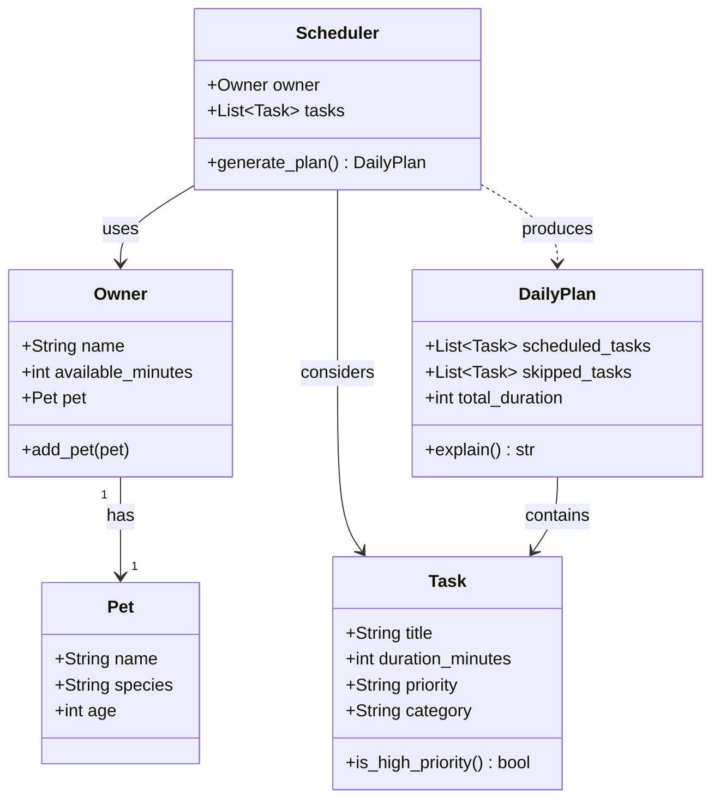

# PawPal+ Project Reflection

## 1. System Design

**a. Core user actions**

1. **Set up owner and pet profile** — The user enters basic information about themselves (e.g., time available in the day) and their pet (e.g., name, species, age). This context shapes what tasks are relevant and how the schedule is constrained. For example, a user with only 2 hours free should not receive a plan that demands 4 hours of activity.

2. **Add and manage care tasks** — The user can create, edit, or remove individual pet care tasks such as walks, feedings, medication, grooming, or enrichment activities. Each task carries at minimum a duration (how long it takes) and a priority (how critical it is to complete today). This gives the scheduler the raw material it needs to build a plan.

3. **Generate and review a daily schedule** — The user requests a daily plan and receives an ordered list of tasks that fit within their time constraints, ranked by priority. The app explains why it chose to include or exclude specific tasks, so the user understands the tradeoffs and can adjust their inputs if needed.

**b. Initial design**

The system has five classes. Each has a focused responsibility with no overlap:

| Class | Attributes | Methods | Responsibility |
|---|---|---|---|
| `Pet` | `name`, `species`, `age` | _(none)_ | Pure data object — describes the pet whose care is being planned |
| `Task` | `title`, `duration_minutes`, `priority`, `category` | `is_high_priority()` | Represents one care activity; knows enough about itself to answer priority questions |
| `Owner` | `name`, `available_minutes`, `pet` | `add_pet(pet)` | Holds the owner's profile and their single time constraint (available minutes per day) |
| `Scheduler` | `owner`, `tasks` | `generate_plan()` | The only class with scheduling logic — reads the owner's budget and task list, decides what fits |
| `DailyPlan` | `owner`, `scheduled_tasks`, `skipped_tasks`, `total_duration`, `skip_reasons` | `explain()` | Captures the Scheduler's output and can narrate the reasoning behind every inclusion and exclusion |

**Relationships:**
- `Owner` has exactly one `Pet` (one-to-one; the app targets a single pet at a time)
- `Scheduler` uses `Owner` (to read the time budget) and a list of `Task` objects
- `Scheduler` produces a `DailyPlan`
- `DailyPlan` contains `Task` objects split into scheduled vs. skipped

**b. Design changes**

After reviewing the class skeleton, two problems surfaced that required changes before any logic was written:

1. **Added `owner` to `DailyPlan`** — The original `DailyPlan` held only tasks and a duration total. When implementing `explain()`, it would have no way to reference the pet's name, the owner's name, or the original time budget. Adding `owner: Owner` gives `explain()` the context it needs to produce a meaningful narrative (e.g., "Jordan had 90 minutes available; Mochi's morning walk and feeding were scheduled, totalling 45 minutes.").

2. **Made `pet` an optional constructor argument on `Owner`** — The original design set `pet = None` in `__init__` and relied entirely on `add_pet()` to assign it. This meant a `Scheduler` could be built around an `Owner` with no pet, a silent error. Accepting `pet` as an optional keyword argument in `__init__` allows the pet to be set at construction time when available, while keeping `add_pet()` for the two-step UI flow where owner and pet info are entered separately.

---

## 2. Scheduling Logic and Tradeoffs

**a. Constraints and priorities**

The scheduler considers three layered constraints:

1. **Time budget** (`Owner.available_minutes`) — No task is scheduled if it would exceed the remaining minutes, regardless of priority. This is the most important constraint because it reflects reality: a 30-minute walk can't happen in a 10-minute window.

2. **Priority** (`Task.priority`: `"high"`, `"medium"`, `"low"`) — the first tiebreaker inside the time budget. Higher-priority tasks are always attempted before lower-priority ones within the same pass. A missed high-priority medication matters more than a missed enrichment activity.

3. **Frequency** (`Task.frequency`: `"daily"`, `"weekly"`, `"as-needed"`) — the second tiebreaker and the basis for two-pass scheduling. Daily tasks get a dedicated first pass before weekly or as-needed tasks compete for the remaining budget.

The decision to rank time > priority > frequency came from a simple thought: if I could only schedule one thing today, what would it be? The answer was always a high-priority daily task (medication), never a low-priority weekly task (grooming), regardless of their duration. That thought directly maps to the sort key in `generate_plan()`.

**b. Tradeoffs**

**Tradeoff: Exact time-slot matching vs. duration-overlap detection**

The `detect_conflicts()` method flags a conflict only when two tasks share the
*exact same `start_time` string* (e.g., both are `"09:00"`). It does **not**
check whether two tasks' time windows overlap — for example, a 30-minute task
starting at `08:45` and a 60-minute task starting at `09:00` would run
concurrently from `09:00` to `09:15`, but the scheduler would not warn about it.

*Why this tradeoff is reasonable here:*

Duration-overlap detection requires converting `"HH:MM"` strings to `datetime`
objects, computing each task's end time (`start + duration`), and then comparing
every pair of tasks to check for intersection. For a small daily task list (5–15
tasks), the added complexity is rarely worth the benefit: most pet care tasks
(feeding, medication, a walk) are discrete activities that don't actually run in
parallel. 

*When this tradeoff would stop being reasonable:*

If the app were extended to support a shared household calendar (multiple owners,
vet appointments, dog-walker slots), duration-aware overlap detection would become
necessary. At that point, converting `start_time` to a `datetime` and storing
`end_time = start_time + timedelta(minutes=duration_minutes)` would be the right
next step.

---

## 3. AI Collaboration

**a. How you used AI**

AI was used for three phases of the project, each with a different kind of prompt:

**Design brainstorming** — Early on, I asked Claude: "Given these three user actions (set up profile, manage tasks, generate a plan), what is the minimum set of classes needed to keep responsibilities clean?" The back-and-forth helped me spot that my original design combined `Scheduler` (decision logic) and `DailyPlan` (output representation) into one class. Splitting them made both easier to test.

**Logic implementation** — For `detect_conflicts()`, I described the bucketing strategy in plain English and asked Claude to translate it into Python using `defaultdict`. This was faster than writing it from scratch, and because I had already designed the algorithm, I could immediately check whether the generated code matched my desired intention.

**Test generation** — After the system was working, I described the three behaviors to verify (sorting, recurrence, conflict detection) and asked for pytest functions with edge cases. The AI generated a solid baseline code; I then reviewed each test against the actual method signatures to confirm the assertions were testing the right thing.

The most effective prompts were **narrow and role-specific**: "Write only the sort key lambda for this method" produced cleaner output than "Write the whole scheduler class." Broad prompts tended to generate plausible-but-wrong structure; narrow prompts generated usable code that I could assess line by line.

**Which Claude/Copilot features were most effective:**

- **Automatically using codebase for context** — Having the codebase accessible while asking Claude to implement a specific method meant suggestions were already shaped to the existing class interface. The AI didn't need to guess field names or method signatures.
- **Explaining existing code** — Asking "What does this sort key actually do step by step?" before accepting it was more reliable than trusting that generated code was correct just because it looked reasonable.
- **Test scaffolding** — Generating the `make_task()` helper and the `make_scheduler()` saved the most time. Boilerplate test setup is tedious to write manually, but easy for AI to get right.

**b. Judgment and verification**

During test generation, Claude initially suggested a test for `detect_conflicts` that created two tasks with the same title and then asserted the conflict message contained that title. The test would have passed — but it was testing the wrong thing. The conflict arises from two tasks sharing the same time slot, not from having the same name. A pet could have "Walk" scheduled for both Monday and Tuesday without conflict; the test as written would have flagged that incorrectly.

I rejected the title-based assertion and rewrote the test to make sure that the conflict message contained the time string that is the actual key the system uses for detection. I verified this by reading `detect_conflicts()` line by line and confirming that `time_slot` not title drives the warning string.

---

## 4. Testing and Verification

**a. What you tested**

21 tests across four groups:

| Group | What it verifies | Why it matters |
|---|---|---|
| **Sorting** | `sort_by_time` returns tasks in ascending `HH:MM` order; timeless tasks land last; empty input is safe | If sorting is wrong, the displayed schedule is misleading even when the logic behind it is correct |
| **Recurrence** | Daily tasks get a `+1 day` successor; weekly tasks get `+7 days`; `as-needed` tasks return `None`; new task appears in `get_pending_tasks()` | Recurrence is the system's only stateful mutation — a silent bug here would cause tasks to disappear permanently |
| **Conflict detection** | Same date + same time → conflict flagged; different time or different date → no flag; no `start_time` → skipped | Users rely on this to catch scheduling mistakes; false positives are as harmful as false negatives |
| **Edge cases** | Empty pet, empty owner, duplicate `add_task` raises, `is_high_priority()` flag, unknown title returns `None` | Boundary conditions are where silent data corruption is most likely |

**b. Confidence**

**★★★★☆ (4 / 5)**

The behaviors tested are the ones most likely to affect real users day-to-day, and all 21 tests pass cleanly. Confidence is high for the core loop: add tasks → complete a task → verify recurrence → check for conflicts.

The missing star reflects behaviors not yet covered:

- `generate_plan()` greedy scheduling: does it always schedule the highest-priority daily tasks first when the budget is tight?
- Duration-overlap conflicts (two tasks whose windows intersect without sharing an exact start time)
- `filter_tasks()` with `pet_name` + `completed` combined
- `Owner.remove_pet()` and `Pet.remove_task()` mutation correctness

---

## 5. Reflection

**a. What went well**

The class boundary between `Scheduler` and `DailyPlan` is the part I'm most satisfied with. It would have been easy to put `explain()` into `Scheduler`, but keeping the output object separate means the plan can be inspected, stored, or displayed independently of the logic that created it. That decision made testing simpler too. I could construct a `DailyPlan` directly in a test without running the full scheduling algorithm.

**b. What you would improve**

Two things:

1. **Duration-overlap conflict detection** — The current exact-match approach is a potential issue. I would add end-time computation (`start + timedelta(minutes=duration_minutes)`) and check for interval intersection. This would require storing `start_time` as a `time` object rather than a raw string, which is a small but worthwhile edit.

2. **`Owner` owning a list of pets, not just one** — The original design targeted a single pet. The implementation already moved to `owner.pets: list[Pet]`, but the Streamlit UI and some documentation still frame it as single-pet. A full redesign would have multi-pet support cleanly through the UI and make conflict detection pet-aware (flagging which pets are affected, not just which tasks).

**c. Key takeaway**

The most important lesson was that AI makes you a faster architect, not a better one by default. Claude could generate a plausible `detect_conflicts()` in seconds, but "plausible" is not the same as "correct for this specific design." The moment I stopped reading generated code carefully because it ran without errors, was exactly when bugs slipped through (like the title-based conflict test that asserted the wrong thing).

Using separate sessions for different phases (design → implementation → testing) helped in keeping differing logic separate - a single long conversation would have blurred the logic eventually. Each session started with a description of what I needed and why, which forced me to say my intent again rather than carry along assumptions from the previous phase. That repeated clarification prevented clashing ideas early on.

Even if a test runs, AI can get the logic run which is hard to fully catch if its something that only periodicially acts up. It's still up to humans to ensure everything is working correctly and maintain comprehension of the code. 
