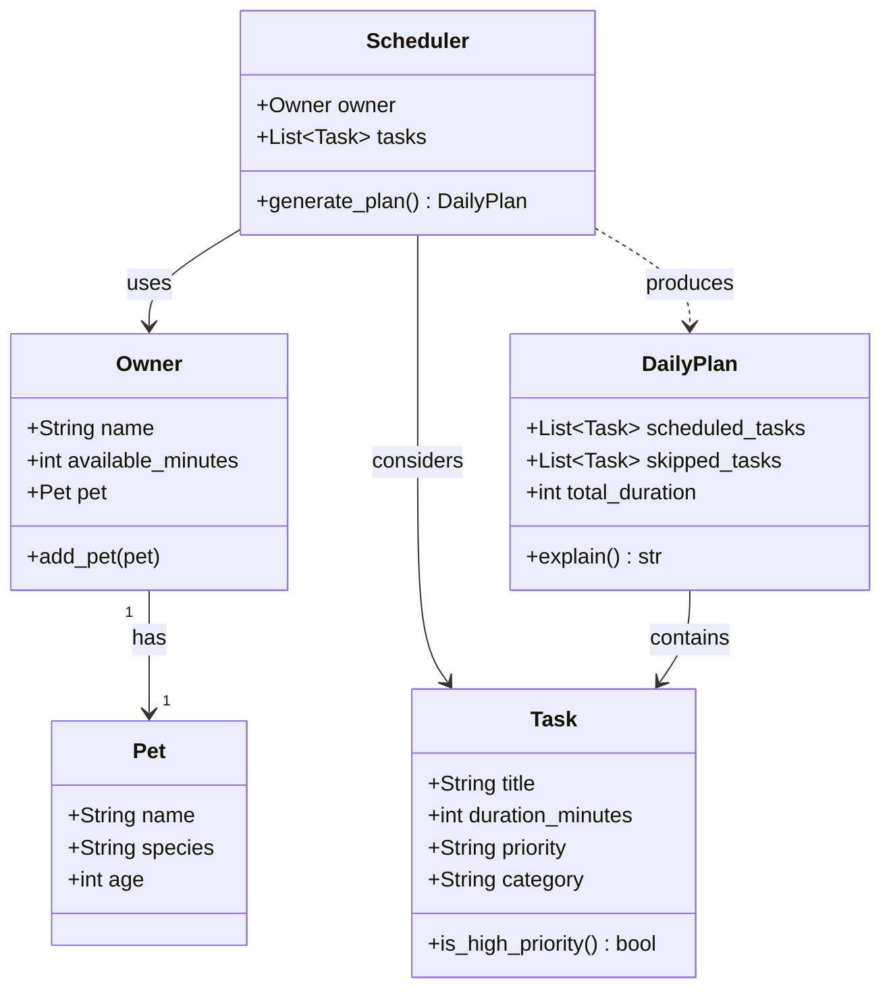

# PawPal+ Project Reflection

## 1. System Design

**a. Core user actions**

1. **Set up owner and pet profile** — The user enters basic information about themselves (e.g., time available in the day) and their pet (e.g., name, species, age). This context shapes what tasks are relevant and how the schedule is constrained. For example, a user with only 2 hours free should not receive a plan that demands 4 hours of activity.

2. **Add and manage care tasks** — The user can create, edit, or remove individual pet care tasks such as walks, feedings, medication, grooming, or enrichment activities. Each task carries at minimum a duration (how long it takes) and a priority (how critical it is to complete today). This gives the scheduler the raw material it needs to build a plan.

3. **Generate and review a daily schedule** — The user requests a daily plan and receives an ordered list of tasks that fit within their time constraints, ranked by priority. The app explains why it chose to include or exclude specific tasks, so the user understands the tradeoffs and can adjust their inputs if needed.

**b. Initial design**

The system has five classes. Each has a focused responsibility with no overlap:

| Class | Attributes | Methods |
|---|---|---|
| `Owner` | `name`, `available_minutes`, `pet` | `add_pet(pet)` |
| `Pet` | `name`, `species`, `age` | _(data only)_ |
| `Task` | `title`, `duration_minutes`, `priority`, `category` | `is_high_priority()` |
| `Scheduler` | `owner`, `tasks` | `generate_plan()` |
| `DailyPlan` | `scheduled_tasks`, `skipped_tasks`, `total_duration` | `explain()` |

**Relationships:**
- `Owner` has exactly one `Pet` (one-to-one; the app targets a single pet at a time)
- `Scheduler` uses `Owner` (to read the time budget) and a list of `Task` objects
- `Scheduler` produces a `DailyPlan`
- `DailyPlan` contains `Task` objects split into scheduled vs. skipped

**b. Design changes**

- Did your design change during implementation?
- If yes, describe at least one change and why you made it.

---

## 2. Scheduling Logic and Tradeoffs

**a. Constraints and priorities**

- What constraints does your scheduler consider (for example: time, priority, preferences)?
- How did you decide which constraints mattered most?

**b. Tradeoffs**

- Describe one tradeoff your scheduler makes.
- Why is that tradeoff reasonable for this scenario?

---

## 3. AI Collaboration

**a. How you used AI**

- How did you use AI tools during this project (for example: design brainstorming, debugging, refactoring)?
- What kinds of prompts or questions were most helpful?

**b. Judgment and verification**

- Describe one moment where you did not accept an AI suggestion as-is.
- How did you evaluate or verify what the AI suggested?

---

## 4. Testing and Verification

**a. What you tested**

- What behaviors did you test?
- Why were these tests important?

**b. Confidence**

- How confident are you that your scheduler works correctly?
- What edge cases would you test next if you had more time?

---

## 5. Reflection

**a. What went well**

- What part of this project are you most satisfied with?

**b. What you would improve**

- If you had another iteration, what would you improve or redesign?

**c. Key takeaway**

- What is one important thing you learned about designing systems or working with AI on this project?
